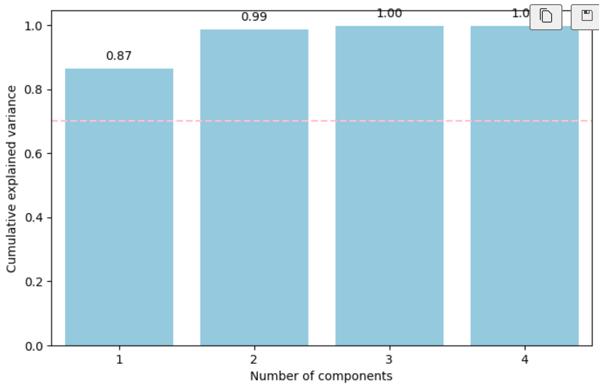
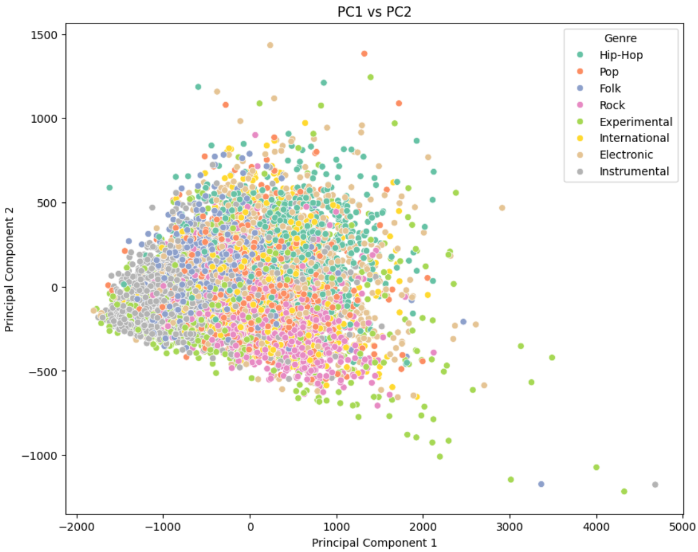
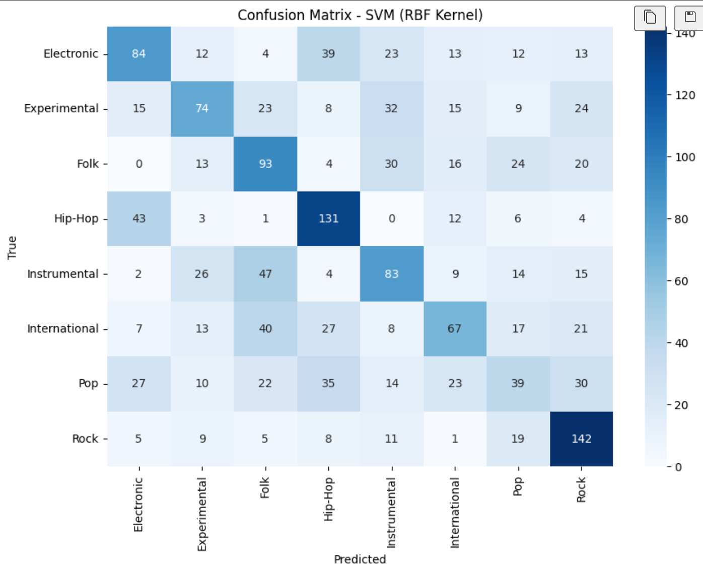
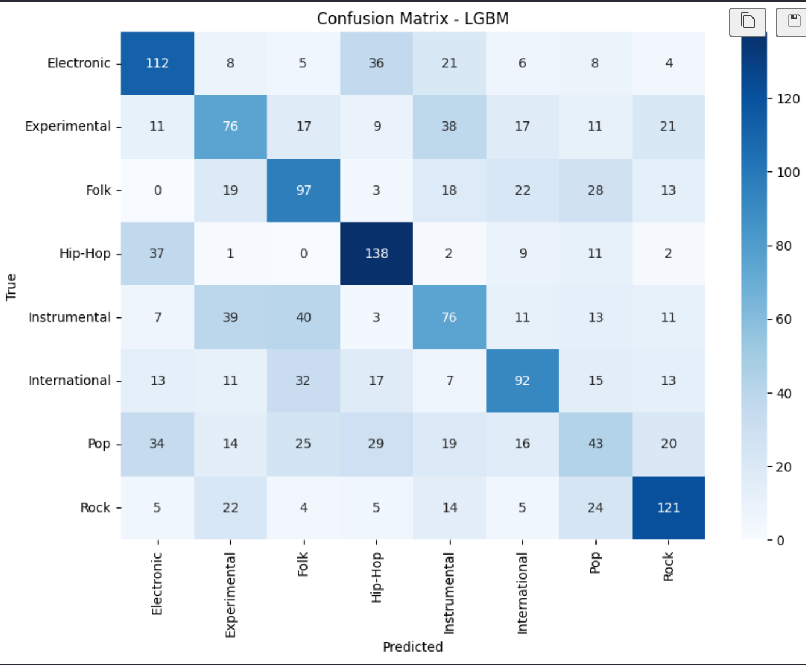
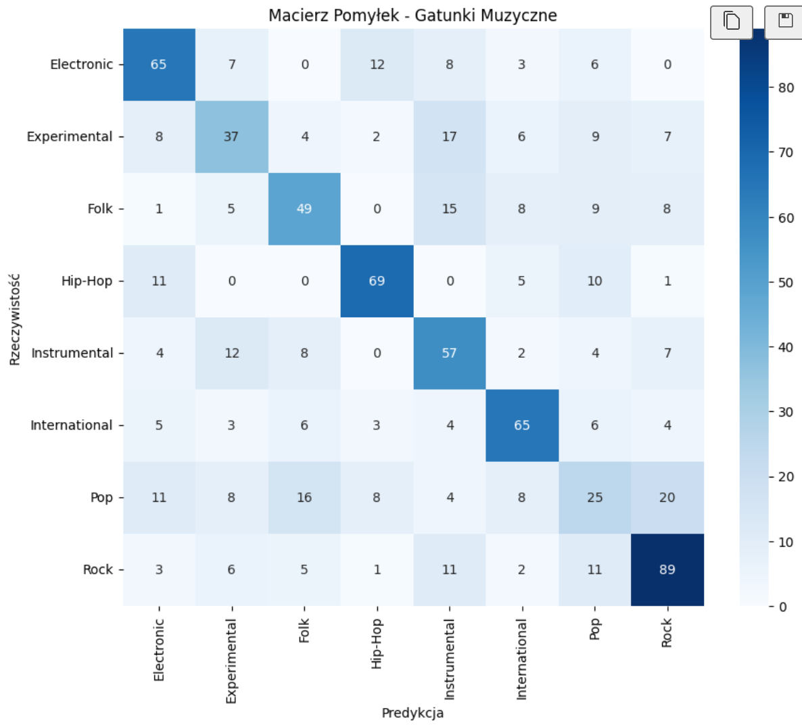

# Music Genre Classification on the FMA Dataset 
*Music Genre Classification using Classical ML and Transformer-based Transfer Learning on the FMA Dataset*

**Course:** Data Mining  
**Institution:** AGH Kraków  
**Date:** March - May 2026  

## Abstract

Music genre classification is a long‑standing challenge, due to the high variability of musical styles, overlapping acoustic characteristics, and the subjective nature of genre boundaries. This project investigates the effectiveness of both classical machine learning methods and modern deep learning approaches for automatic genre prediction using the Free Music Archive (FMA) dataset, focusing on the balanced FMA Small subset.  

The study begins with extensive audio feature extraction using Librosa and Essentia, followed by preprocessing steps such as scaling and dimensionality reduction with PCA. Several classical models including Logistic Regression, Support Vector Machines, Random Forests, and LightGBM were trained and evaluated. Among these, LightGBM achieved the strongest performance with an accuracy of 0.47, showing particular strength in genres with distinctive rhythmic or instrumental patterns (Hip‑Hop, Rock, Electronic).

To explore the benefits of representation learning, a Transformer‑based model (DistilHuBERT) was fine‑tuned on raw audio waveforms. This transfer learning approach significantly outperformed all classical baselines, reaching 0.57 accuracy and improving F1‑scores across nearly all genres. Despite these gains certain categories, especially Pop, remained difficult to classify due to their stylistic diversity and overlap with other genres.

Overall, the results highlight the limitations of hand-crafted audio features and demonstrate the superior ability of self supervised Transformer models to capture complex musical structure.

## Introduction

Music genre classification is an interesting and challenging task because music is complex, diverse, and often hard to describe using simple rules. Many genres share similar sounds, instruments, or rhythms, and some tracks mix elements from several styles. Because of this, even humans sometimes disagree about the correct genre. For machine learning models, the problem becomes even harder: they must learn patterns from audio signals that are noisy, varied, and full of subtle details.

The Free Music Archive (FMA) dataset is a popular open dataset used in music research. It contains thousands of tracks from many genres, with a wide range of styles and recording qualities. This makes it a good benchmark, but also a difficult one. Some genres, like Hip‑Hop or Electronic, have strong and recognizable patterns. Others, like Pop or Experimental, are more mixed and harder to classify.

There are two main ways to approach this task. The first uses hand‑crafted audio features, such as MFCCs, chroma features, spectral statistics, and rhythm descriptors. These features can be used with classical machine learning models like Logistic Regression, SVM, Random Forest, or LightGBM. The second approach uses end‑to‑end deep learning, where a neural network learns directly from raw audio. Modern Transformer‑based models, such as DistilHuBERT, can capture much deeper and more abstract information from sound.

The goal of this project is to compare these two approaches. I wanted to see how classical ML models perform when using engineered audio features, and how much improvement can be achieved with a pre‑trained Transformer model fine‑tuned on the FMA dataset. I also wanted to understand which genres are easier or harder to classify, and which types of features seem most helpful for the task.

## Dataset Description

The dataset used in this project comes from the Free Music Archive (FMA), an open collection of music tracks released under Creative Commons licenses. The specific subset used here is FMA Small, which contains 8,000 tracks evenly distributed across 8 genres. Each track is a 30‑second audio clip.

The official repository is available at: https://github.com/mdeff/fma

The dataset includes two main components:
- Metadata files (contain information such as genre, artist, album)
- Audio files (30s clips, stored in a structured folder hierarchy based on track IDs)

Genres in FMA SMALL:
- Electronic
- Experimental
- Folk
- Hip-Hop
- Instrumental
- International
- Pop
- Rock

## Data preparation 
- Resampling: All audio files were loaded with a fixed sampling rate of 22050 Hz. This allowed the models to keep the most important acoustic information while reducing the computational load.
- Mono Conversion: Multi-channel (stereo) audio files were forced to a single mono channel during loading. This step removed spatial differences and standardized the input signal for the feature extraction libraries.

## Feature Engineering
### Librosa
Feature engineering was an important part of this project, especially for the classical machine learning models. I used the Librosa library to extract several groups of audio features that describe different aspects of the signal, such as timbre, energy, pitch content, and spectral shape.

I created two versions of the feature set:

- a smaller set (~70 features) – using only the mean and standard deviation of each feature,
- a larger set (~519 features) – where I originally included many more statistics (skewness, kurtosis, median, min, max), but later removed them to simplify the feature space.

Both versions were tested in the experiments. The smaller set was easier to train and less prone to overfitting, while the larger set captured more detailed information about the audio signal.

Description of all calculated Librosa features:
- **Zero Crossing Rate (ZCR):** counts how often the audio signal changes sign (from positive to negative or the opposite).
- **Chroma STFT:** describe the distribution of energy across the 12 pitch classes (C, C#, D, …, B).
- **RMS Energy:** represents the loudness or energy of the signal over time.
- **Spectral Centroid:** is often described as the “center of mass” of the spectrum. It tells how bright or dark the sound is.
- **MFCCs (Mel-Frequency Cepstral Coefficients):** MFCCs are one of the most widely used features in audio analysis.
They describe the timbre of the sound — the overall “color” or texture.

The larger set originally included many additional statistics, but these were later removed because they increased dimensionality without improving model performance. The smaller set turned out to be more stable and easier to use with classical ML models.

---

### Essentia
I also created a second feature set using the Essentia library. Essentia is widely used in Music Information Retrieval because it provides high‑quality audio descriptors and a more detailed signal analysis pipeline. It processes audio frame‑by‑frame and gives very stable results for spectral and harmonic features.

Just like with Librosa, I extracted the same five groups of features:

- Zero Crossing Rate
- RMS Energy
- Spectral Centroid
- Chroma (HPCP)
- MFCC

This allowed me to compare both libraries directly and check whether Essentia’s implementations improve classification performance.

The final Essentia feature set has the same structure as the Librosa one: each feature group is summarized using mean and standard deviation, which keeps the dimensionality manageable and consistent across both pipelines.

---

### Dimensionality Reduction with PCA
To better understand the structure of the feature space and to reduce dimensionality, I applied Principal Component Analysis (PCA) to both Librosa feature sets. PCA is often used to compress high‑dimensional data while keeping most of the variance, and it can  help classical ML models work faster or generalize better.

For both feature sets, I generated a cumulative explained variance plot. Surprisingly, the first two principal components explained almost 100% of the total variance [1]. At first glance, this might suggest that the data lies mostly in a low‑dimensional space and that PCA should work very well. However, this turned out to be misleading.

<figure>
  
  <figcaption>[1] Cumulative Explained Variance</figcaption>
</figure>

The reason is that many audio features are highly correlated. For example:

- MFCC coefficients often move together,
- chroma bins are related harmonically,
- RMS, spectral centroid, and ZCR all depend on energy and brightness.

Because of this, PCA captures a lot of variance very quickly - but this variance does not correspond to meaningful structure for classification.

I also plotted the projection of all samples onto the first two components [2]. The result was very clear - all points were clustered tightly in one place, with no visible separation between genres. There were no clusters, no patterns, and no boundaries.

<figure>
  
  <figcaption>[2] PCA1/PCA2</figcaption>
</figure>

This showed that even though PCA explains almost all variance, the variance it captures is not related to genre differences.

## Classical Machine Learning Models
### Algorithms
In this part of the project, I focused on four classical machine learning algorithms:  
- Logistic Regression
- Support Vector Machine (SVM)
- Random Forest (RF)
- LightGBM (LGBM)  
All models were trained and evaluated on a standard train–test split (80/20).  
The goal was to see how far we can go using only hand‑crafted audio features, before moving to deep learning.  

### Experimental Setup and Feature Configurations
Each algorithm was tested on several feature configurations:
- Librosa – small set (reduced feature set)
- Librosa – full set (large feature set)
- Essentia – small set

For every feature set, I also tried a PCA‑based version:

- Essentia + PCA
- Librosa small + PCA
- Librosa full + PCA

However, the results with PCA were consistently very poor.
Models trained on PCA features showed very low accuracy, almost random predictions. Because of this, all PCA‑based variants were discarded, and only the original feature sets (without PCA) were used in the final comparison.

### Evaluation metrics
Each model was evaluated using:
- Classification report:
  - accuracy
  - precision
  - recall
  - f1
- confucion matrix  
Both were computed on training and test sets.

### Hyperparameter tuning
Hyperparameters were tuned using a mix of:
- grid search (for structured exploration of parameter ranges),
- manual, experimental adjustments (based on observed behavior of the models).

The main goal was to maximize test performance and reduce overfitting as much as possible.  
In practice, this was difficult.
Tree‑based models (Random Forest, LightGBM) in particular tended to overfit, especially on the larger Librosa feature set. Regularization, limiting tree depth, and reducing the number of leaves helped, but did not fully solve the problem.

### Overall behavior of the algorithms
- Logistic Regression
  - Simple baseline
  - Struggled with the complexity of the data and non‑linear boundaries between genres.
  - Poor performance
- SVM
  - Performed much better than Logistic Regression, especially with the Librosa small feature set.
  - Non‑linear kernel (RBF) helped capture more complex patterns.
- RF
  - Tended to overfit on the training set, even with limited depth.
  - Test performance was decent, but not the best.
- LightGBM
  - Achieved the strongest results overall, especially on the Librosa full feature set.
  - Very flexible and powerful, but also prone to overfitting.

Results with Essentia features were generally worse than with Librosa, so I did not go into deep analysis of those models in the report.

### Best-performing models
Two models stood out as the best among all classical approaches:  
1. **SVM with Librosa small feature set**
  - Test accuracy: 0.45
  - Train accuracy: 0.51
  - Good balance between performance and overfitting.
  - Worked well despite the reduced number of features.
  - Hyperparameters: kernel = rbf, gamma = 0.01, C = 0.1  

Classification Report (test set):  

| Genre | Precision | Recall | F1-Score | Support |
| :--- | :---: | :---: | :---: | :---: |
| **Electronic** | 0.46 | 0.42 | 0.44 | 200 |
| **Experimental** | 0.46 | 0.37 | 0.41 | 200 |
| **Folk** | 0.40 | 0.47 | 0.43 | 200 |
| **Hip-Hop** | 0.51 | 0.66 | 0.57 | 200 |
| **Instrumental** | 0.41 | 0.41 | 0.41 | 200 |
| **International** | 0.43 | 0.34 | 0.38 | 200 |
| **Pop** | 0.28 | 0.20 | 0.23 | 200 |
| **Rock** | 0.53 | 0.71 | 0.61 | 200 |
| | | | | |
| **Overall Acc** | | | **0.45** | **800** |

Confusion Matrix (test set):

<figure>
  
</figure>

2. **LightGBM with Librosa full set**
  - Test accuracy: 0.47
  - Train accuracy: 0.84
  - Highest accuracy across all models
  - but slightly overfitted (train performance much higher than test)
  - Hyperparameters: n_estimators = 50, learning_rate = 0.04, max_depth = 5

Classification Report (test set):

| Genre | Precision | Recall | F1-Score | Support |
| :--- | :---: | :---: | :---: | :---: |
| **Electronic** | 0.51 | 0.56 | 0.53 | 200 |
| **Experimental** | 0.40 | 0.38 | 0.39 | 200 |
| **Folk** | 0.44 | 0.48 | 0.46 | 200 |
| **Hip-Hop** | 0.57 | 0.69 | 0.63 | 200 |
| **Instrumental** | 0.39 | 0.38 | 0.38 | 200 |
| **International** | 0.52 | 0.46 | 0.49 | 200 |
| **Pop** | 0.28 | 0.21 | 0.24 | 200 |
| **Rock** | 0.59 | 0.60 | 0.60 | 200 |
| | | | | |
| **Overall Acc** | | | **0.47** | **1600** |

Confusion Matrix (test set):

<figure>
  
</figure>

### Confusion Matrix Analysis
To better understand how the classical models behave on individual genres, I analysed the confusion matrices for the two best-performing models. Confusion matrices show not only the overall accuracy, but also the flow of mistakes - which genres are confused with which. 

**SVM (RBF Kernel) Librosa Small Features**  
The model performs best on:  
- Hip-Hop (131 correct)
- Rock (142 correct)
- Folk (93 correct)
- Electronic (84 correct)  

These genres have more distinctive rhythmic or timbral characteristics, which SVM can capture even with a relatively small feature set.  

Weakest performance: 
- Pop (only 39 correct). 

Pop is stylistically broad and overlaps with Rock, Electronic, and even Folk. This is visible in the confusion matrix: Pop samples are scattered across many predicted genres.

Misclassification flows:  
Pop tracks are often predicted as Rock, Electronic, Hip Hop. There is a strong two-way confusion between Electronic and Hip Hop. Both genres share abstract textures, noise elements, and non‑traditional structures. Instrumental tracks are sometimes predicted as Folk and International. This makes sense: many instrumental tracks rely on acoustic instruments that resemble these genres.

**LightGBM – Librosa Full Features:**
The model performs very well on:  
- Hip-Hop (138 correct)
- Electronic (112 correct)
- Rock (121 correct)
- Folk (97 correct)
- International (92 correct)

These numbers are slightly higher than SVM, which explains the better accuracy.

Weakest Performance:
- Pop (only 43 correct)

Pop remains the hardest genre for all classical models.

Misclassification flows:  
Pop is again scattered across several genres, but LightGBM predicts Rock even more often than SVM. This confirms that Pop is acoustically diverse and not well represented by hand-crafted features. Other flows are very similar to SVM flows.

**Conclusion:** 
Genres easiest to classify:
- Rock
- Electronic
- Hip Hop

Genre hardest to classify:
- Pop

## Deep Learning: Transfer Learning with DistilHuBERT
After testing classical machine learning models on hand‑crafted audio features, the next step was to use a modern deep learning approach. Instead of relying on manually engineered descriptors such as MFCCs or chroma features, deep learning models can learn their own representations directly from the raw audio signal. 

In this project, I used DistilHuBERT, a lightweight Transformer‑based model designed for audio understanding. It is a distilled version of HuBERT, which means it keeps most of the performance of the original model while being faster and easier to train.

DistilHuBERT is a self‑supervised Transformer model trained on large amounts of unlabeled audio. It learns general acoustic patterns such as timbre and rythm. Even though it was originally trained for speech tasks, these learned representations transfer surprisingly well to music. Compared to classical ML it does not need MFCCs or spectral features and captures much deeper and more abstract information. 

### Dataset Preparation
The deep learning pipeline starts with the same FMA Small dataset used earlier.  

Each track is:
- loaded from disk,
- resampled to 16 kHz (required by the model),
- trimmed or padded to 10 seconds,
- converted into the input format expected by the Hugging Face feature extractor.

The dataset was encoded and split into:
- 90% training,
- 10% testing.

### Training
Training was done using the Hugging Face Trainer API with the following settings:
- learning rate: 5e‑5
- batch size: 4
- epochs: 3
- weight decay: 0.01
- fp16: enabled for faster GPU training
- evaluation each epoch
- saving checkpoints each epoch

Training was performed on a GTX 1070 Ti, which reduced training time from several hours on CPU to 2 hour.

### Model Performance
After training, the model was evaluated on the test split.

Classification Report:

| Genre | Precision | Recall | F1-Score | Support |
| :--- | :---: | :---: | :---: | :---: |
| **Electronic** | 0.60 | 0.64 | 0.62 | 101 |
| **Experimental** | 0.47 | 0.41 | 0.44 | 90 |
| **Folk** | 0.56 | 0.52 | 0.54 | 95 |
| **Hip-Hop** | 0.73 | 0.72 | 0.72 | 96 |
| **Instrumental** | 0.49 | 0.61 | 0.54 | 94 |
| **International** | 0.66 | 0.68 | 0.67 | 96 |
| **Pop** | 0.31 | 0.25 | 0.28 | 100 |
| **Rock** | 0.65 | 0.70 | 0.67 | 128 |
| | | | | |
| **Overall Acc** | | | **0.57** | **800** |

Confusion Matrix:

<figure>
  
</figure>

### Classification Report and Confusion Matrix Analysis (DistilHuBERT)
After fine‑tuning DistilHuBERT on 10‑second audio segments from the FMA Small dataset, the model reached a test accuracy of 0.57, which is a clear improvement over all classical machine learning models. To understand how the model behaves across different genres, I analysed both the classification report and the confusion matrix.

The report shows that DistilHuBERT performs consistently better than classical ML models across almost all genres. The strongest results appear in:
- Rock
- Hip‑Hop
- Electronic
- International

These genres have distinctive rhythmic or timbral signatures, which the Transformer model captures well from raw audio.

Pop remains the most difficult genre to classify. This is consistent with all previous experiments: Pop overlaps stylistically with Rock, Electronic, and even Folk, making it hard to separate based on audio alone.

**Key Misclassification Flows:**
- Pop tracks are most often misclassified as Rock, Electronic, Folk.
- Experimental tracks are frequently predicted as Instrumental.

## Final Summary and Conclusions
This project explored the problem of music genre classification using both classical machine learning models and a modern deep learning approach. The experiments covered three different feature sets (Librosa small, Librosa full, Essentia), four classical algorithms (Logistic Regression, SVM, Random Forest, LightGBM), and a Transformer‑based model (DistilHuBERT) fine‑tuned directly on raw audio.

Across all experiments, several clear patterns emerged.

### Classical ML vs Deep Learning
Classical machine learning models rely entirely on hand‑crafted features such as MFCCs, chroma, RMS, and spectral descriptors. These features capture only a small portion of the information present in the audio signal. As a result:
- classical models reached 0.45–0.47 accuracy,
- they often overfitted (especially tree‑based models),
- they struggled with subtle timbral differences,
- their confusion matrices showed scattered and unstable predictions.

In contrast, the deep learning model (DistilHuBERT):
- learned rich, contextual acoustic representations directly from the waveform,
- captured long‑range temporal structure, timbre, and spectral evolution,
- achieved around 0.57 accuracy,
- produced more meaningful and musically logical predictions,
- showed less overfitting and more stable behavior.

The improvement of ~10 percentage points is significant, especially considering that the dataset is small and the model was trained for only 3 epochs.

### Why Some Genres Are Easy to Classify
Across all models (classical and deep learning), the same genres consistently achieved the highest scores:

**Rock**  
  - strong, steady rhythm
  - characteristic guitar timbre
  - dense mid‑frequency energy 

These cues are easy for both MFCC‑based features and Transformers to detect.

**Hip Hop**
  - dominant low‑frequency beats
  - repetitive rhythmic structure
  - clear separation between drums and vocals

Even simple features like spectral centroid and ZCR help distinguish Hip‑Hop from other genres.

**Electronic**
  - bright, synthetic timbres
  - stable, repetitive patterns
  - strong high‑frequency content

Electronic music has a very recognizable spectral profile, which both ML and DL models capture well.

### Why Pop Is the Hardest Genre
Pop consistently showed the lowest precision and recall in every model.
There are several reasons for this:
- Pop is a meta‑genre that borrows from other genres.
- Production style overlaps with other genres.
- Pop tracks vary widely in tempo, instrumentation, and timbre

### What This Project Demonstrates
1. Hand‑crafted features have clear limitations  
MFCCs, chroma, and spectral descriptors capture only surface‑level information.
They work for simple patterns but fail for complex genre boundaries.
2. Deep learning learns richer representations
3. Genre classification is inherently difficult
4. Some genres are naturally easier

### Final Conclusion
The results clearly show that deep learning is the most effective approach for music genre classification on the FMA dataset. Classical ML models provide a useful baseline, but they are limited by the quality and expressiveness of hand‑crafted features. DistilHuBERT, even with minimal fine‑tuning, learns much deeper and more meaningful audio representations, leading to significantly better performance and more stable predictions.

At the same time, the project highlights the natural difficulty of the task. Genre boundaries are fuzzy, and some categories - especially Pop - cannot be cleanly separated based on audio alone. Despite these challenges, the deep learning model demonstrates strong generalization and captures real musical structure, making it the most promising direction for future work.

